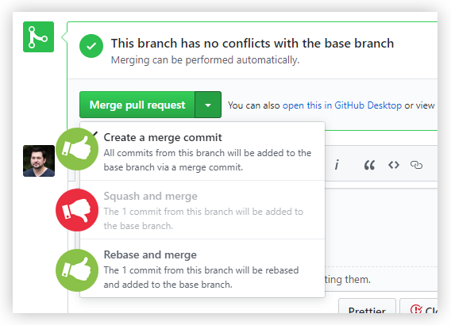

# @werkzeugkiste/release-config 

This is the shared [`semantic-release`](https://semantic-release.gitbook.io/) config for all things [@werkzeugkiste](https://www.github.com/werkzeugkiste) related. It includes a `semantic-release` config for libraries and a [`commitlint`](https://commitlint.js.org/) config that works well together with the `semantic-release` config. It also has `semantic-release` and `commitlint` as direct dependencies so it does not need to be installed separately.

With this `semantic-release` config you get the following features out of the box:

- version number detection for releases based on commit messsages
- version number is written back to package.json
- publishing of new release versions to npm
- creation of tags incl. release notes on GitHub for every new release
- generation of a CHANGELOG.md file containing all changes since last release
- rejection of commits that are not according to the commit message convention (optional)

The `semantic-release` and `commitlint` configs are basically based on the Angular config/preset but extended with some additional features and custom commit types.

## Installation

```sh
# installation using yarn
yarn add --dev @werkzeugkiste/release-config
```

```sh
# installation using npm
npm install --develop @werkzeugkiste/release-config
```

## Usage

If you want to use this config as base in any of your projects, you need to create a `relase.config.js` file in your project folder that re-exports the `semantic-release` config from `@werkzeugkiste/relase-config`.

You can do that by creating a file named `release.config.js` in your project's root folder with the following content:

```js
module.exports = require('@werkzeugkiste/release-config/release.config.js');
```

Optionally, you can also use the corresponding [`commitlint`](https://commitlint.js.org/) config so that commits are only allowed if they are valid `semantic-release` style commits. That means they must have a commit message starting with a _type_ (e.g. `fix:`, `feat:`, `chore:`, ...) followed by an optional scope (e.g. `fix(core):`, `feat(api)`, ...) and a subject (i.e. the actual commit header). Types and scopes are case sensitive and must be all lowercase. Your commit may contain additional description in the commit message body. Have a look at the [Angular Commit Message Guidelines](https://github.com/angular/angular/blob/master/CONTRIBUTING.md#-commit-message-guidelines) for more info. You can find the full commit type/release rules config in [`release.config.js`](./release.config.js).

In order to use the `commitlint` config (and I'd strongly recommend you to do so!) create a file named `.commitlintrc.js` in your project's root folder with the following content:

```js
module.exports = require('@werkzeugkiste/release-config/.commitlintrc.js');
```

Afterwards you need to install and configure [`husky`](https://github.com/typicode/husky) so that git hooks are run whenever something git related happens. Your `.huskyrc` should be updated to look like this:

```js
{
  "hooks": {
    "commit-msg": "commitlint -E HUSKY_GIT_PARAMS"
    // your other hooks:
    // [...]
  }
}
```

## CI/CD integration

`semantic-release` only makes sense if you integrate it into your CD/CI process. Check out the official docs on [CI configuration](https://semantic-release.gitbook.io/semantic-release/usage/ci-configuration) and the [CI recipes](https://semantic-release.gitbook.io/semantic-release/recipes/recipes#ci-configurations) to learn more about how you can use it with the CI tool of your choice.

Since this config is using the GitHub and npm plugins, you must set a `GH_TOKEN` and an `NPM_TOKEN` environment variable in your CI environment as described on the docs page.

## Known issues

- ~~It seems like as if the custom commit types aren't respected by `@semantic-release/release-notes-generator`. This should be investigated. [This Stack Overflow issue might be helpful](https://stackoverflow.com/a/59094119/705377).~~

  **solved:** the angular preset for `release-notes-generator` does not allow to assign custom types to specific sections.

- when `BREAKING CHANGE:` is used in the footer to trigger a new major release, the subject in the header is not included in the release notes. I don't know if this is intentional but it feels wrong to me.

## More info

- `conventional-changelog-conventionalcommits` is used as preset for `release-notes-generator` because it allows us to assign our custom commit types to sections (_headlines_) in the generated release notes and changelog. The `angular` preset for example does not provide such a feature.
- v8.3.3+ of `@commitlint/cli` and `@commitlint/config-conventional` is required for the breaking change shorthand syntax (_`<type>!:`_) to be parsed and recognized properly ([related comment](https://github.com/conventional-changelog/commitlint/issues/658#issuecomment-545172808)).
- This config only triggers new releases from **master** branch. When you're working on branches there are a few important things you should know:

  - if you use the **_Squash and merge_** function on GitHub, all previous commit messages are ignored by `semantic-release`! Only the last merge commit will be used. You should not do that unless it's absolutely necessary. Use the Pull Request title in a `semantic-release` way (i.e. prefix it with the commit type (`fix`, `feat`, etc.)) to tell `semantic-release` whether you want to release a major, minor or patch version. [You can read more about that here.](https://github.com/semantic-release/semantic-release/blob/master/docs/support/troubleshooting.md#squashed-commits-are-ignored-by-semantic-release)

  - if you use the **_Rebase and merge_** or **_Create a merge commit_** function everything works "as expected": all your commits will be analyzed once they're merged into master and `semantic-release` will do its job correctly.

    Here's a little illustration:
    
